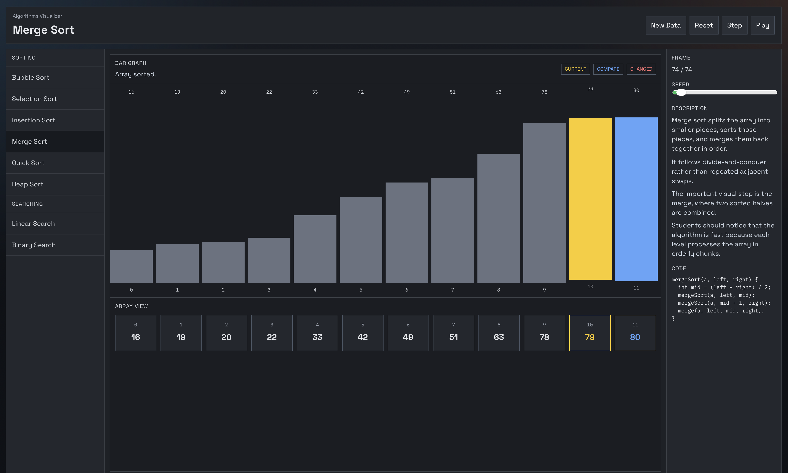

# STEM Visualizer

A classroom-friendly algorithm visualizer built with React and Vite. It shows algorithms in two synchronized ways:

- a bar graph for visual motion and magnitude
- an array view for exact values and indices

The goal is simple: make algorithm behavior easier to teach and easier to understand.

## Preview

### Website



## Features

- Clean sidebar for switching between algorithms
- Animated bar graph with color-coded comparisons
- Large array view under the graph for direct index/value tracking
- Step, play, reset, and new data controls
- Built-in descriptions and pseudocode for each algorithm

## Algorithms Included

### Sorting

- Bubble Sort
- Selection Sort
- Insertion Sort
- Merge Sort
- Quick Sort
- Heap Sort

### Searching

- Linear Search
- Binary Search

## Teaching Notes

Each algorithm includes a short explanation panel that helps students focus on what matters:

- what the pointer is currently looking at
- what value is being compared next
- what values changed position
- how the algorithm’s strategy works over time

Color meanings in the visualizer:

- Yellow: current pointer or active item
- Blue: item being compared
- Red: item that was moved or marked by the current step

## Interface

- Left sidebar: choose a sorting or searching algorithm
- Center panel: see the live bar graph and array view
- Right panel: read the explanation, target value, and reference code

## Run Locally

```bash
npm install
npm run dev
```

## Production Build

```bash
npm run build
```

## Project Structure

```text
src/App.tsx
src/App.css
src/index.css
docs/media/
```

## Why This Project Is Useful

Many visualizers either hide the underlying array too much or focus too much on raw code. This project keeps both in view at the same time, which makes it better for:

- classroom walkthroughs
- AP CSA review
- comparing sorting strategies
- understanding how searching differs from sorting
